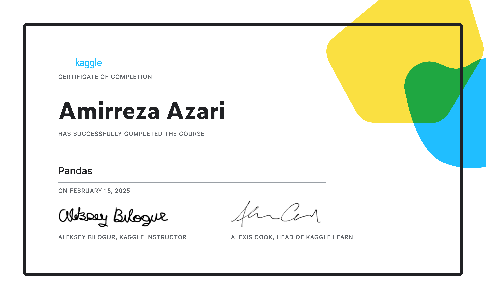

# Kaggle Pandas Course - Solutions

🚀 **Master Pandas for Data Analysis**

Welcome to my repository containing solutions to the exercises from the [Kaggle Pandas Course](https://www.kaggle.com/learn/pandas). This repo serves as a comprehensive reference for mastering data manipulation with Pandas, featuring well-documented solutions and my course completion certificate.

## 📌 Repository Contents

### 📖 1. Creating, Reading & Writing Data
- Loading data from various sources
- Writing and exporting data
- [Functions](https://github.com/Amirreza81/Kaggle-Pandas-Solved-Exercises/blob/main/1.%20Creating%2C%20Reading%20and%20Writing/readme.md)

### 📖 2. Indexing, Selecting & Assigning
- Selecting specific rows and columns
- Advanced indexing techniques
- [Functions](https://github.com/Amirreza81/Kaggle-Pandas-Solved-Exercises/blob/main/2.%20Indexing%2C%20Selecting%20%26%20Assigning/readme.md)

### 📖 3. Summary Functions & Mapping
- Aggregating and summarizing data
- Applying custom transformations
- [Functions](https://github.com/Amirreza81/Kaggle-Pandas-Solved-Exercises/blob/main/3.%20Summary%20Functions%20and%20Maps/readme.md)

### 📖 4. Grouping & Sorting
- Performing **groupby()** operations
- Sorting and ranking data
- [Functions](https://github.com/Amirreza81/Kaggle-Pandas-Solved-Exercises/blob/main/4.%20Grouping%20and%20Sorting/readme.md)

### 📖 5. Data Types & Handling Missing Values
- Converting data types
- Dealing with missing data
- [Functions](https://github.com/Amirreza81/Kaggle-Pandas-Solved-Exercises/blob/main/5.%20Data%20Types%20and%20Missing%20Values/readme.md)

### 📖 6. Renaming & Combining DataFrames
- Renaming columns efficiently
- Merging and concatenating datasets
- [Functions](https://github.com/Amirreza81/Kaggle-Pandas-Solved-Exercises/blob/main/6.%20Renaming%20and%20Combining/readme.md)

## 🏆 Certification
My **Kaggle Pandas Course Certificate**:



## 🚀 How to Use This Repository

1. Clone this repo:
   ```sh
   git clone https://github.com/your-username/kaggle-pandas-course.git
   ```
2. Open Jupyter Notebook or Google Colab.
3. Explore and modify the notebooks to enhance your understanding.


